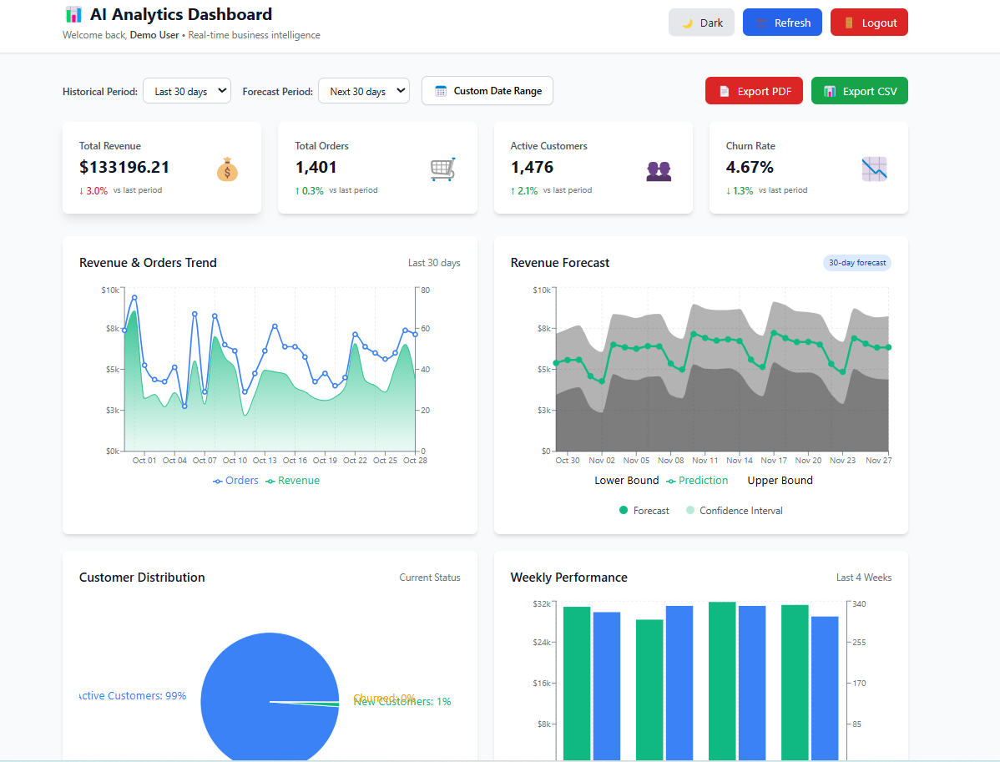
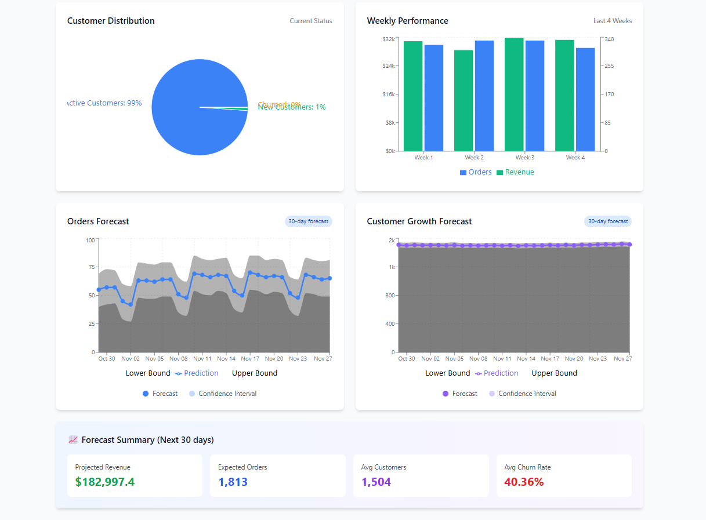
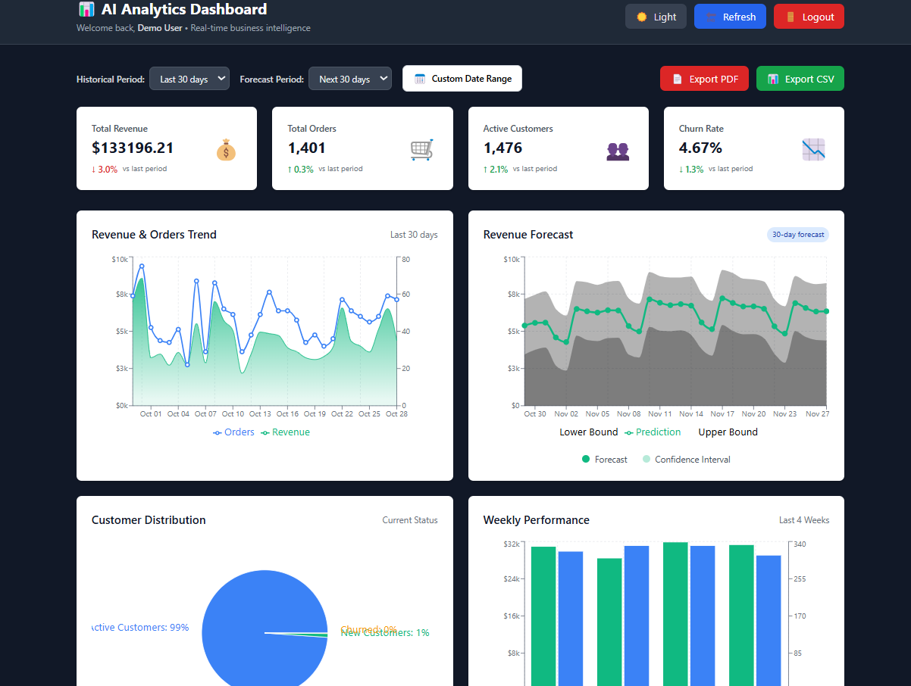
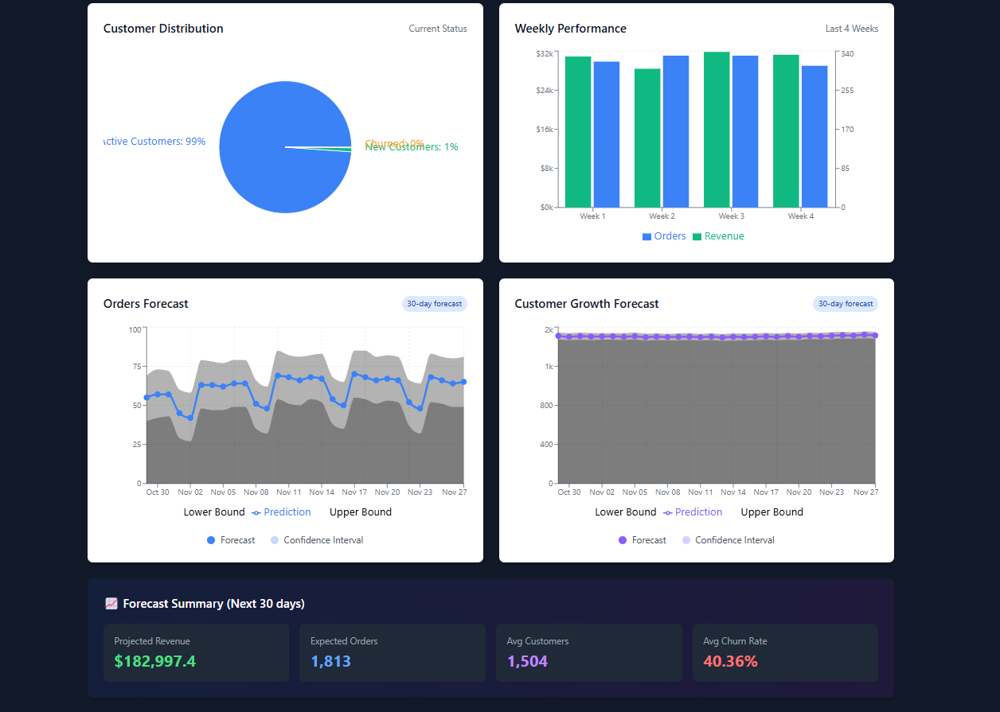
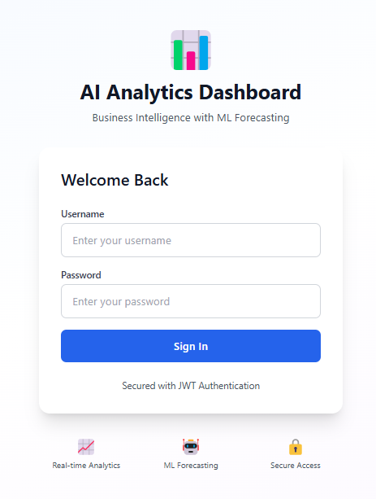
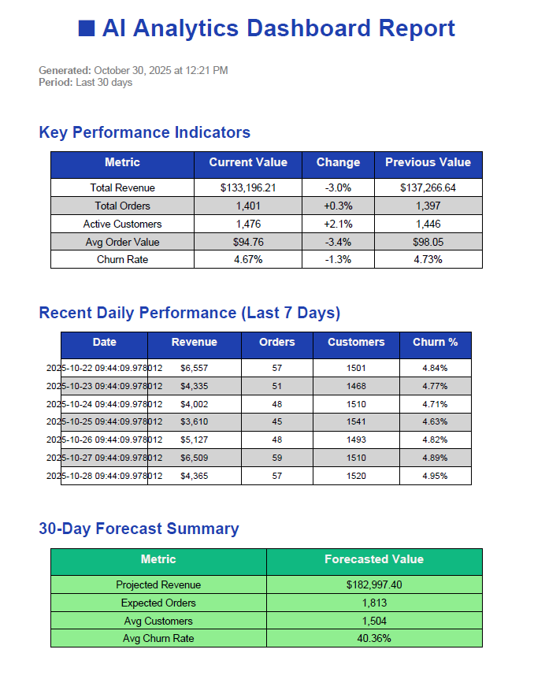

# 📊 AI Analytics Dashboard

> Full-stack business intelligence platform with ML-powered forecasting, real-time metrics, and interactive visualizations.

## 🌟 Live Demo

- **Frontend**: [ai-business-analytics-dashboard.vercel.app](ai-business-analytics-dashboard.vercel.app)
- **Backend API**: [https://ai-business-analytics-dashboard-1.onrender.com](https://ai-business-analytics-dashboard-1.onrender.com)
- **API Documentation**: [https://ai-business-analytics-dashboard-1.onrender.com/docs](https://ai-business-analytics-dashboard-1.onrender.com/docs)


### Dashboard - Light Mode
 
 

### Dashboard - Dark Mode



---

## 🌟 Features

### Analytics & Insights
- 📈 **Real-time KPIs** - Revenue, Orders, Customers, Churn Rate with trend indicators
- 📊 **Interactive Charts** - Line charts, bar charts, pie charts with Recharts
- 🔮 **ML Forecasting** - 30-90 day predictions using Facebook Prophet
- 📅 **Custom Date Ranges** - Flexible time period selection with date picker

### Data Export
- 📄 **PDF Reports** - Professional reports with KPIs and forecasts
- 📊 **CSV Export** - Raw data export for Excel/Sheets analysis

### User Experience
- 🔐 **JWT Authentication** - Secure login with token-based auth
- 🌙 **Dark Mode** - Beautiful dark theme with smooth transitions
- 📱 **Responsive Design** - Works perfectly on desktop, tablet, and mobile
- ⚡ **Fast & Performant** - Optimized API calls with caching

---

## 🛠️ Tech Stack

### Backend
- **FastAPI** - Modern Python web framework
- **Prophet** - Facebook's time-series forecasting library
- **Pandas & NumPy** - Data manipulation and analysis
- **ReportLab** - PDF generation
- **Python-JOSE** - JWT token management

### Frontend
- **React 18** - UI framework with TypeScript
- **Tailwind CSS** - Utility-first styling
- **Recharts** - Data visualization library
- **Axios** - HTTP client
- **Date-fns** - Date manipulation

### Deployment
- **Vercel** - Frontend hosting
- **Render** - Backend API hosting

---

## 🚀 Quick Start

### Prerequisites
- Python 3.11+
- Node.js 16+
- npm or yarn

### Backend Setup

```bash
cd backend

# Create virtual environment
python -m venv venv
source venv/bin/activate  # On Windows: venv\Scripts\activate

# Install dependencies
pip install -r requirements.txt

# Run server
python app/main.py
```

API will be available at `http://localhost:8000`
- Swagger UI: `http://localhost:8000/docs`

### Frontend Setup

```bash
cd frontend

# Install dependencies
npm install

# Start development server
npm start
```

App will be available at `http://localhost:3000`

---

## 📸 Screenshots

### Login Page


### PDF Export


---

## 🎯 API Endpoints

### Authentication
```
POST   /api/auth/login       - Login and get JWT token
GET    /api/auth/me          - Get current user info
```

### Metrics
```
GET    /api/metrics/daily    - Daily business metrics
GET    /api/metrics/weekly   - Weekly aggregated data
GET    /api/metrics/kpis     - Key performance indicators
GET    /api/metrics/summary  - Overall statistics
```

### Forecasting
```
GET    /api/forecast/revenue    - Revenue forecast (30-90 days)
GET    /api/forecast/orders     - Orders forecast
GET    /api/forecast/customers  - Customer growth forecast
GET    /api/forecast/churn      - Churn rate forecast
GET    /api/forecast/all        - Comprehensive forecast
GET    /api/forecast/accuracy   - Model accuracy metrics
```

### Export
```
GET    /api/export/pdf       - Generate PDF report
GET    /api/export/csv       - Export data as CSV
```

---

## 🔐 Demo Credentials

```
Admin Account:
Username: admin
Password: admin123

Demo Account:
Username: demo
Password: demo123
```

---

## 📊 ML Forecasting

The dashboard uses **Facebook Prophet** for time-series forecasting:

- **Daily/Weekly/Yearly Seasonality** - Captures patterns in business cycles
- **Trend Analysis** - Identifies growth or decline patterns
- **Confidence Intervals** - Shows prediction uncertainty ranges
- **Accuracy Metrics** - MAPE, RMSE, MAE for model validation

### Forecast Accuracy
- Revenue: ~8-12% MAPE (Mean Absolute Percentage Error)
- Orders: ~10-15% MAPE
- Customers: ~5-8% MAPE

---

## 🎨 Dark Mode

Toggle between light and dark themes with a single click. Theme preference is saved in localStorage for persistent experience across sessions.

---

## 📦 Project Structure

```
ai-analytics-dashboard/
├── backend/
│   ├── app/
│   │   ├── main.py              # FastAPI application
│   │   ├── auth.py              # JWT authentication
│   │   ├── data/                # CSV data files
│   │   └── services/
│   │       ├── ml_forecasting.py   # Prophet forecasting
│   │       └── pdf_generator.py    # PDF reports
│   ├── requirements.txt
│   └── render.yaml              # Render deployment config
│
├── frontend/
│   ├── src/
│   │   ├── components/          # React components
│   │   ├── services/            # API client
│   │   ├── contexts/            # Theme context
│   │   └── App.tsx
│   ├── tailwind.config.js
│   ├── vercel.json              # Vercel deployment config
│   └── package.json
│
└── README.md
```

---

## 🚀 Deployment

See [DEPLOYMENT_GUIDE.md](DEPLOYMENT_GUIDE.md) for detailed instructions.

### Quick Deploy

**Backend (Render):**
```bash
# Push to GitHub
git push origin main

# Render auto-deploys from main branch
```

**Frontend (Vercel):**
```bash
# Install Vercel CLI
npm i -g vercel

# Deploy
cd frontend
vercel --prod
```

---

## 🧪 Testing

### Backend Tests
```bash
cd backend
python test_forecasting.py
python test_auth.py
```

### Frontend Tests
```bash
cd frontend
npm test
```

---

## 📈 Performance

- **API Response Time**: <200ms (cached)
- **Forecast Generation**: 2-5 seconds
- **PDF Generation**: 1-3 seconds
- **Frontend Load Time**: <2 seconds

---

## 🤝 Contributing

Contributions are welcome! Please feel free to submit a Pull Request.

1. Fork the repository
2. Create your feature branch (`git checkout -b feature/AmazingFeature`)
3. Commit your changes (`git commit -m 'Add some AmazingFeature'`)
4. Push to the branch (`git push origin feature/AmazingFeature`)
5. Open a Pull Request

---

## 📝 License

This project is licensed under the MIT License - see the [LICENSE](LICENSE) file for details.

---

## 🙏 Acknowledgments

- [FastAPI](https://fastapi.tiangolo.com/) - Modern Python web framework
- [Facebook Prophet](https://facebook.github.io/prophet/) - Time-series forecasting
- [Recharts](https://recharts.org/) - React charting library
- [Tailwind CSS](https://tailwindcss.com/) - Utility-first CSS framework

---

## 👨‍💻 Author

**Obiajulu Emmanuel**
- GitHub: [@objemmanuel](https://github.com/objemmanuel)
- LinkedIn: [Obiajulu Emmanuel](https://www.linkedin.com/in/obiajulu-emmanuel-609170234)

---

## 🌟 Show Your Support

Give a ⭐️ if this project helped you!

---

Made with ❤️ and ☕